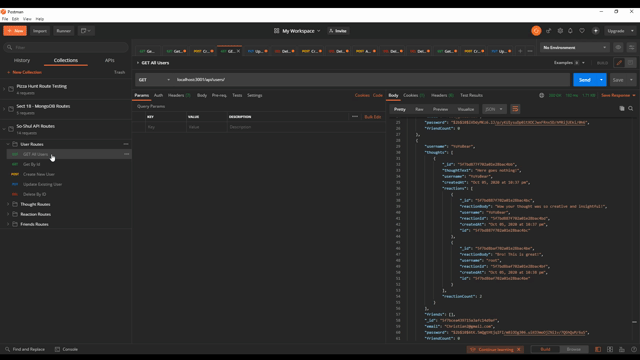

# [So-Shul Network API](http://www.github.com/SmithBWare89/so-shul-api)

## Description
This project is intended to be a demonstration of a RESTful API using a combination of MongoDB, Express, Mongoose, and Moment. It's been expanded to include a minimalist front end to allow for a web app representation of the data being created in our database. Further developments for this project would be to update the formatting of the project along with streamlining the API routes.

## User Story
```
AS A social media startup
I WANT an API for my social network that uses a NoSQL database
SO THAT my website can handle large amounts of unstructured data
```

## Table of Contents
* [Installation](#installation)
* [Usage](#usage)
* [License](#license)
* [Languages](#languages)
* [Packages](#packages)
* [Contributing](#contributing)
* [Questions](#questions)

## Installation
You can visit the deployed [web application](https://so-shul-api.herokuapp.com/) which is in it's development phase or by cloning the repository, installing the node packages using the `npm i` in your command line, and then running `npm start` to start your connection.

#### Walkthrough of how to test and generate a User.
[](https://youtu.be/aIUjCNlWDxg)
#### Walkthrough of how to test and generate a Thought.
[](https://youtu.be/5zWWJ3K7gJ8)
#### Walkthrough of how to test and generate a Friends/Reactions relationship.
[](https://youtu.be/qmuJAAG0RwM)

## License
[](https://opensource.org/licenses/MIT)

## Languages


## Packages


## Contributing
Create a pull request on the repository.

## Questions
All questions can be directed to [my email](smithwrestling89@gmail.com) or [github](https://www.github.com/SmithBWare89).
  